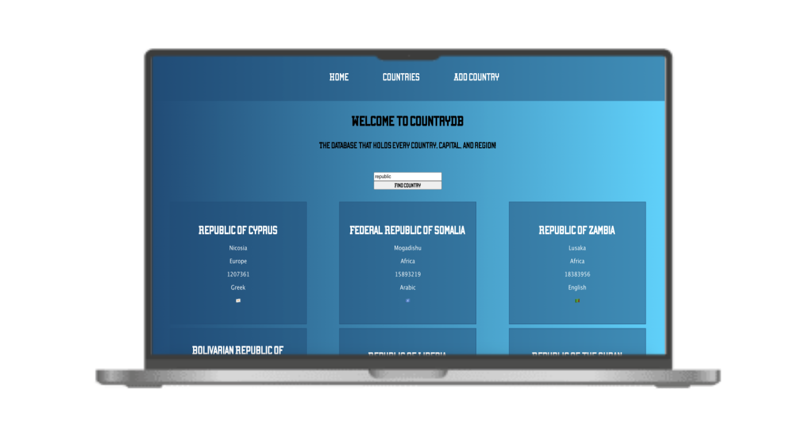
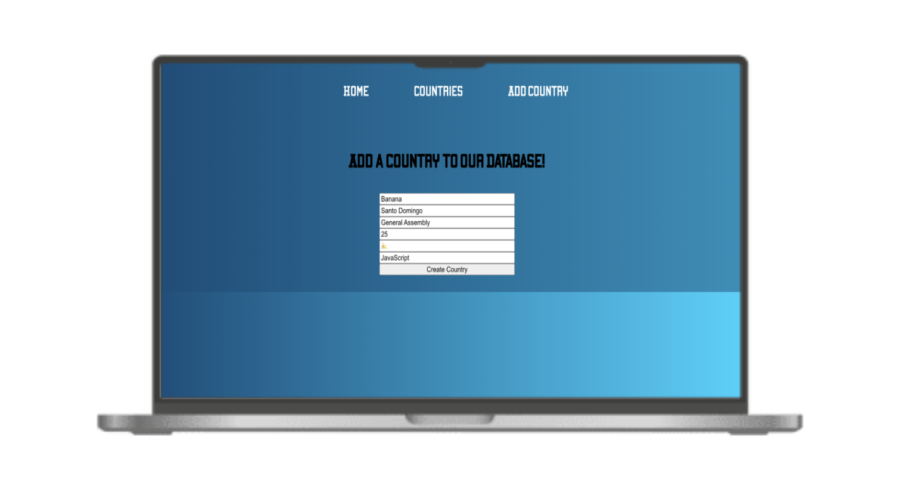
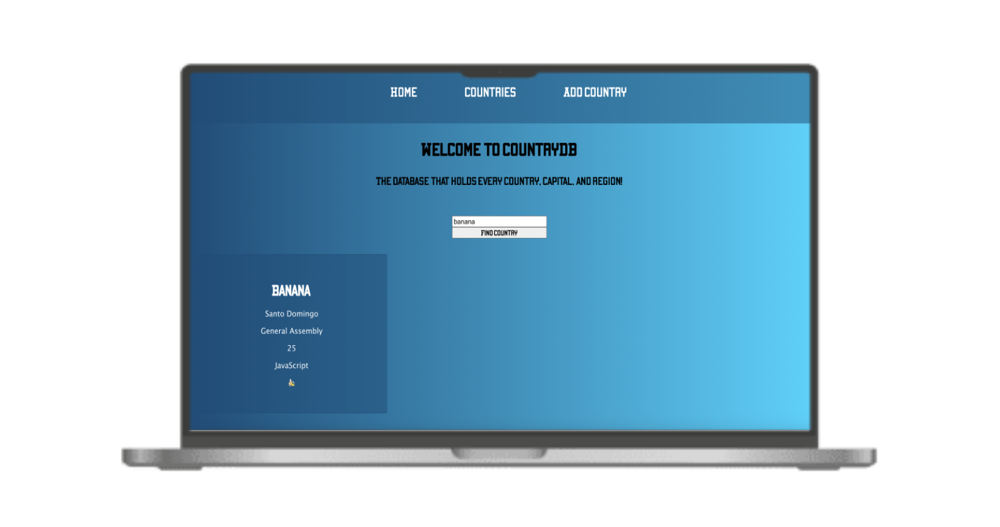
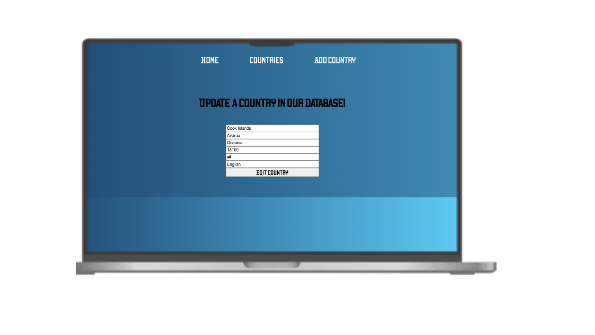
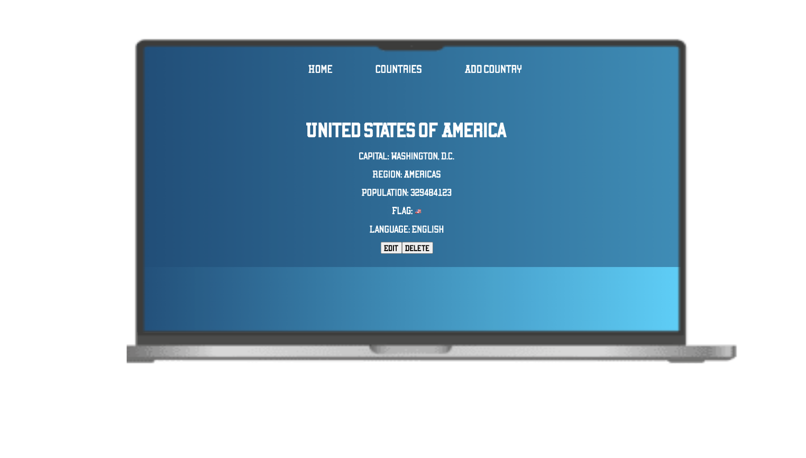

# CountryDB!

Welcome to CountryDB, the database that holds every country! Each country includes it's capital, region, population, flag and primary language.

You can even edit, add, and delete countries if you desire. This read me will show you the ins and outs of CountryDB.

## Finding a Country

To find a country, type it into the search box and click "Find Country". If you do an exact search, one country exactly matching your query will pop up.

If you type in part of a country name, and more than one country broadly matches that name, you'll get multiple results. For example, simply typing "republic" in the box will return all countries with the name "republic" in the title.

## Adding a Country

All countries are in the database, but feel free to add another country if you'd like! A new country could be forming this very second and you may be the only person who knows. 

To add a country:

<ul>
    <li>Navigate to the "Add Country" page.</li>
    <li>Enter the country's info: country name, capital, region, population, flag (emoji), and primary language.</li>
    <li>Click the "Create Country" button on the buttom of the form.</li>
    <li>The country should then be added to the database!</li>
</ul>

Here's an example below:

Once you created your country, you should be able to search for it on the homepage or see it on the Countries page. Below is a screenshot of what would show up when you search for it.

## Editing or Deleting a Country

To edit a country, you can go to the Countries page or search for a country on the homepage. Once you've found your country, click on it. You will be redirected to a page with only that country.

At the bottom of the country's information, you will see an Edit and Delete button.

Click the edit button, and you will be redirected to an edit page:

To delete a country, you can navigate to to Countries page or search for a country on the homepage. Once you have found your country and click on it, you will be redirected to the details page. 

The "Delete" button will be on the bottom of the details. Click on it and the country will be deleted! 

### Technology Used 

<ul>
    <li><a href="https://react.dev">React</a></li>
    <li><a href="https://github.com/AleksandreChkhikvishvili/Back-end-Project">Countries API</a></li>
</ul>